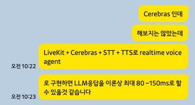
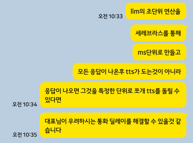

# 캡스톤 일지 

## <팀 정보>
팀명 : There is no project
본인 이름 : 정시영
## <캡스톤 프로젝트 진행 날짜>
2026년 09월 02일
## <일주일 동안 내가 만들어 낸 것(만들어낸 것이 없으면 노력한 것, 학습한 것도 가능)>
프로젝트 진행 상황 파악, 문제 해결 과정에 참가해 해결 방법 제시

## <일주일 동안 겪었던 힘든 점, 극복했다면 해결 방법>
'많은 일들이 겹치는 것은 힘듭니다.'
## <내가 잘한 것과 더 잘할 수 있었는데 아쉬웠던 점>
'더 열심히 참가하고 싶었는데 일정때문에 못하였습니다.'
## <다음주까지 해올 것>
' 캡스톤 발표를 준비하고 ios를 완성해야 합니다.'

### 회의 내용 요약

1. Rn -> Flutter 이주(And -> IOS)
- react 개발을 배우면서 하면 시간이 오래 걸리니 Flutter로 ios로 개발하는데 보호자 앱 중심으로 개발(9/11일까지)
- 부모님 앱 부분은 추후 개발

2. 랜딩 페이지 수정
   - 8/19일 기준 최신 버전 기준으로 수정 완료
   - Vox AI 페이지 반영해서 더 수정하기
   - '부모님 한 분 더 등록시 ~~원 결제' 문구 변경

3. 방글이 앱 무설치 버전
- 영실이 앱을 참고해서 개발
- 070 번호를 받아서 그룹별로 묶어서 070 번호 하나씩 사용(?)